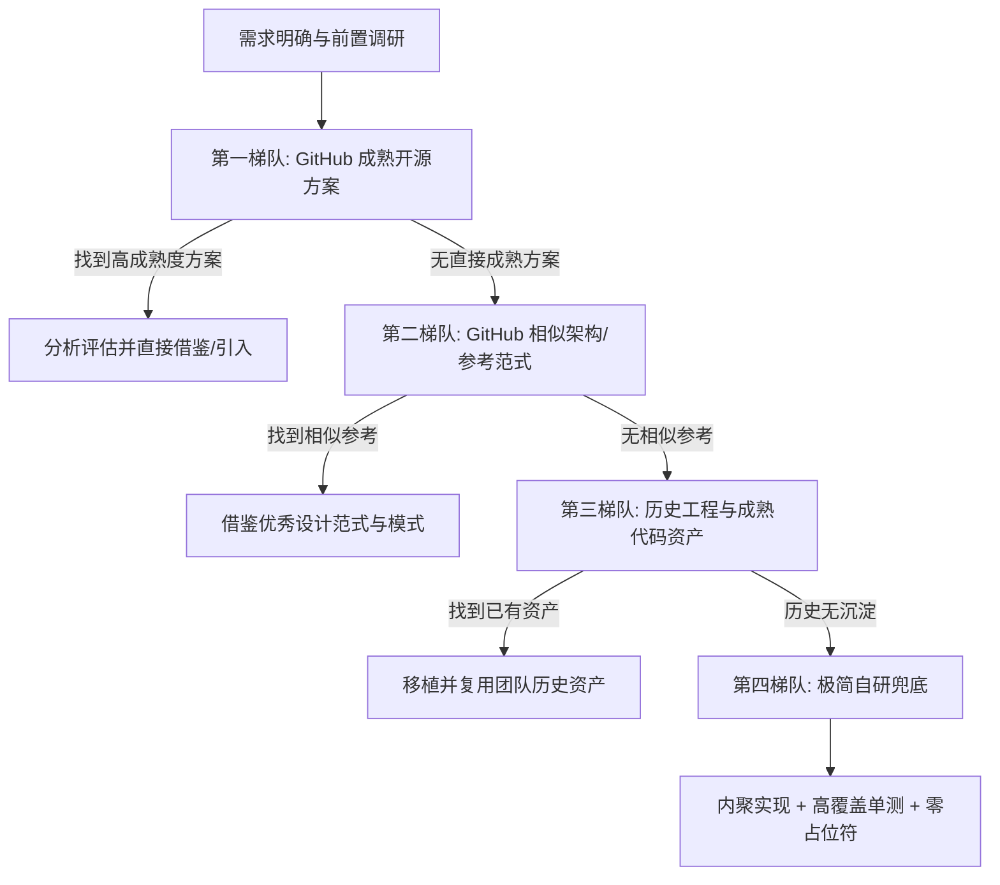

# 开发工作流与代码复用规范 (Development Workflow & Code Reuse)

在着手编写任何具体业务或功能代码之前，**必须严格遵循前置复用检索与渐进式开发流程**，恪守 KISS 原则，严禁盲目从零造轮子。

---

## 一、代码复用阶梯法则 (四阶梯检索流程)

每次动手开发新功能、新模块或修复复杂缺陷前，必须按以下优先级自上而下检索并决策：

### 1. 第一优先级：成熟开源方案 (GitHub 成熟库 / 权威社区)
- **检索目标**：优先在 [GitHub](https://github.com) 检索已经受生产环境广泛检验、活跃维护、拥有良好口碑的成熟开源项目与标准库。
- **质量准绳**：代码必须成熟稳定，严禁引入未经检验、长期未维护或过度激进的实验性轮子。
- **决策要点**：如果成熟库完全覆盖需求且维护良好，优先通过包管理器引入或标准借鉴，不重复造轮子。

### 2. 第二优先级：相似项目参考 (GitHub 相似场景与优秀范式)
- **检索目标**：若无直接对应的成熟独立库，在 GitHub 上检索相似业务场景、类似数据流或相近架构的高星开源项目。
- **吸收重点**：参考其模块划分、接口定义（深模块设计）、容错处理与边界应对方案。

### 3. 第三优先级：历史代码资产 (历史项目/模块移植)
- **检索目标**：若外部社区缺乏合适实现，检索用户或团队在历史工程中编写过的成熟模块、工具函数、适配器或设计范式。
- **复用要点**：直接移植经过验证的健壮逻辑，保持命名与调用风格一致，减少试错成本。

### 4. 第四优先级：自研兜底 (极简自研与高质量交付)
- **准入条件**：唯有在经过前三层阶梯检索均无成熟、可靠方案时，方可自研。
- **设计标准**：
  - **深模块（Deep Modules）**：小接口、强内聚、清晰接缝（Seam）。
  - **KISS 原则**：杜绝过度设计与臆想式抽象。
  - **测试驱动（TDD）**：自研代码必须具备配套的单元测试与回归测试用例。

---

## 二、开发执行红线

1. **先调研再编码**：未完成复用检索与方案设计前，禁止随意新增代码文件。
2. **零占位符交付**：交付的所有代码必须为完整生产可用态，严禁出现 `// TODO`、`/* 后续逻辑同上 */`、`# 省略其它代码` 等敷衍截断。
3. **保留原注释与上下文**：非本次改动相关的原有注释、文档与上下文，必须完整保留。
